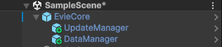

EvieCore - Это набор решений и инструментов для решения различных задач.
Основная задача EvieCore упростить разработчику жизнь, оптимизировать и организовать проект по полочкам.
# Структура EvieCore



Создайте на главной сцене, например в меню вашей игры глобальный объект EvieCore, повесьте на него скрипт EvieCore.cs, и по необходимости настройте его как вам нужно


Параметр DontDestroyThisObject сделает EvieCore доступным по всему проекту, при смене сцен объект не будет удаляться и всегда будет доступен для вас

По мере необходимости добавляйте в EvieCore дочерние объекты которые будут работать в качестве модулей, на данный момент существуют следующие модули:

### UpdateManager

Этот модуль реализует менеджер для обновлений объектов, использующих интерфейс `EvieCoreUpdate`. Он предназначен для того, чтобы централизованно управлять обновлениями компонентов, которые нужно вызывать каждый кадр. 
#### Как использовать:

```csharp
public class ExampleObject : MonoBehaviour, EvieCoreUpdate
{
    private float speed = 5f; // Переменная для скорости движения

    // Этот метод будет вызываться каждый кадр через UpdateManager
    public void OnUpdate()
    {
        // Например, двигаем объект вперед
        transform.Translate(Vector3.forward * speed * Time.deltaTime);
        // Можно добавить дополнительную логику для других обновлений
    }

    void Start()
    {
        // Регистрируем объект в UpdateManager для получения обновлений
        UpdateManager.Instance.Register(this);
    }

    void OnDestroy()
    {
        // Убираем объект из списка обновляемых в UpdateManager
        UpdateManager.Instance.Unregister(this);
    }
}
```

Используйте интерфейс `EvieCoreUpdate` для создания объектов, которые должны получать обновления каждый кадр. Это может быть полезно для таких компонентов, как управление движением, обработка ввода, анимация, обработка логики ИИ, или любые другие задачи, требующие регулярного обновления состояния.
#### Преимущества использования:

- **Централизованное управление обновлениями**: Все объекты, которым нужно обновление каждый кадр, могут быть централизованно управляемы через `UpdateManager`.
- **Легкость добавления новых компонентов**: Когда необходимо добавить новый компонент с логикой обновления, достаточно реализовать интерфейс `EvieCoreUpdate` и зарегистрировать его.
- **Упрощение кода**: Избавляет от необходимости вручную добавлять вызовы обновлений в методах `Update()` множества объектов, уменьшив избыточность и повышая читаемость кода.
### DataManager

Этот модуль реализует централизованный менеджер данных, который позволяет хранить и управлять данными различных типов в словаре. `DataManager` предоставляет методы для добавления, получения, удаления и очистки данных по ключам.

#### Как использовать:

```csharp
public class Player : MonoBehaviour
{
    private void Start()
    {
        // Сохраняем данные
        DataManager.Instance.SetData("PlayerScore", 100);
        
        // Получаем данные
        int score = DataManager.Instance.GetData<int>("PlayerScore");
        Debug.Log($"Player's score: {score}");

        // Проверяем наличие данных
        if (DataManager.Instance.ContainsKey("PlayerScore"))
        {
            Debug.Log("Player score exists.");
        }
        
        // Удаляем данные
        DataManager.Instance.RemoveData("PlayerScore");
    }
}

```

#### Методы DataManager:

- **`SetData<T>(string key, T value)`**: Добавляет или обновляет данные в `dataStore` по ключу. Если ключ уже существует, значение обновляется.
- **`GetData<T>(string key)`**: Получает данные по ключу и приводит их к типу `T`. Если данные не найдены или тип данных не совпадает, возвращается значение по умолчанию для типа `T`.
- **`ContainsKey(string key)`**: Проверяет, существует ли запись с указанным ключом.
- **`RemoveData(string key)`**: Удаляет запись с указанным ключом.
- **`ClearAllData()`**: Очищает все данные в `dataStore`.

#### Преимущества использования:

- **Централизованное управление данными**: Все данные могут быть централизованно хранимы и получены через один объект, что упрощает их управление.
- **Гибкость типов**: Благодаря дженерикам можно хранить и извлекать данные любого типа, обеспечивая безопасность типов во время компиляции.
- **Управление жизненным циклом данных**: Легко удалять или очищать данные в любое время, поддерживая актуальность хранимой информации.
- **Простота в использовании**: С помощью ключей можно легко извлекать и изменять данные, что делает работу с ними интуитивно понятной.


