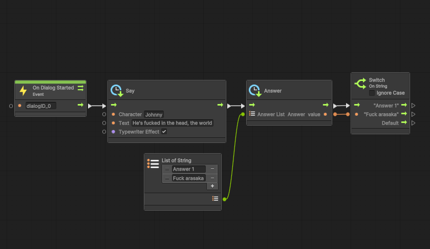

[[Back]](../main.md)

# Einferia

The library will be released soon, the cost of the library will be rather symbolic, a kind of donation to the author for his work.

At the moment, the dialog system is already working stably, which is integrated into Unity Visual Scripting (which gives you the advantage and freedom to create dialogues)

The library will be as customizable as possible. You can create any interface for your dialogs.

